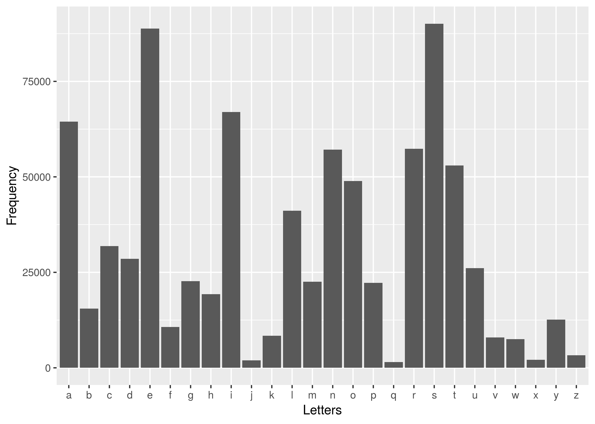

Letter Frequency
================
Ray Wu

``` r
options(warn = -1) # supresses warnings
suppressPackageStartupMessages(library(tidyverse))
```

    ## Note: the specification for S3 class "difftime" in package 'lubridate' seems equivalent to one from package 'hms': not turning on duplicate class definitions for this class.

``` r
library(tidyverse)
```

``` r
data <- read.csv("letterfreq.csv")

plot <- ggplot(data, aes(Letters, Frequency)) + 
    geom_bar(stat = 'Identity')
    
ggsave("letterfreq.png")
```

    ## Saving 7 x 5 in image


