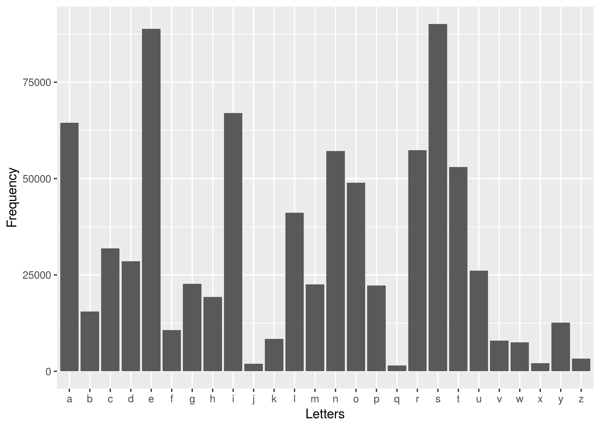

```{r}
options(warn = -1) # supresses warnings
suppressPackageStartupMessages(library(tidyverse))
```

```{r setup, include=FALSE}
knitr::opts_chunk$set(echo = TRUE)
```

```{r}
library(tidyverse)
```

```{r}
data <- read.csv("letterfreq.csv")

plot <- ggplot(data, aes(Letters, Frequency)) + 
	geom_bar(stat = 'Identity')
	
ggsave("letterfreq.png")
```

